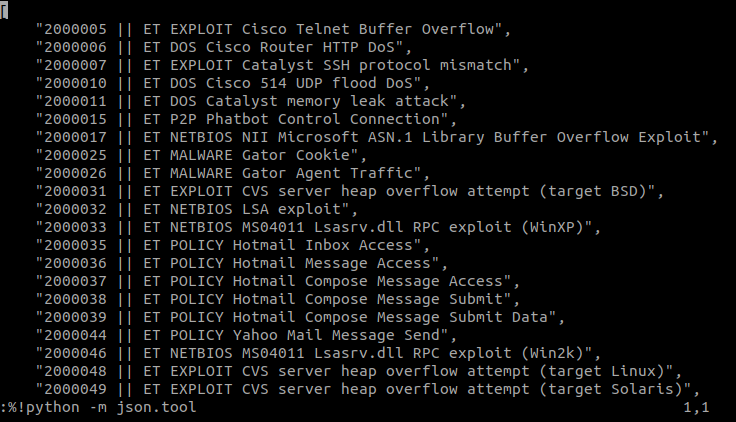

# SuricataSidMap

**SuricataSidMap** is a global sidmap of all public Suricata rulesets *(aprox 100.000 rules)*. It can be used as a manual reference file or to feed a system. Commercial rulesets that make their sidmap available are also included.

# Where do I get it?

The file is available at https://d1ph5fknnx4sb9.cloudfront.net/signatures.txt and the file is updated daily. 

# Rulesets

The following are the rulesets present in the sidmap. If I missed something, feel free to let me know.

* [Emerging Threats Pro](https://rules.emergingthreats.net/sidmap/complete-sidmap.txt)
* [Abuse.ch TLS](https://sslbl.abuse.ch/blacklist/sslblacklist_tls_cert.rules)
* [Abuse.ch JA3](https://sslbl.abuse.ch/blacklist/ja3_fingerprints.rules)
* [Abuse.ch IP Blacklist](https://sslbl.abuse.ch/blacklist/sslipblacklist.rules)
* [Abuse.ch URLhaus](https://urlhaus.abuse.ch/downloads/ids)
* [Travis Green Hunting](https://raw.githubusercontent.com/travisbgreen/hunting-rules/master/hunting.rules)
* [OISF Traffic ID](https://openinfosecfoundation.org/rules/trafficid/trafficid.rules)
* [PT Research Attack Detection](https://github.com/ptresearch/AttackDetection/)

# Parsing for easier viewing

The file does not contain line breaks. If you're using vim and want to parse the file to include them, you can use the following command:

```
:%!python -m json.tool
```



# Ruleset Navigator

I'll release a web rule/ruleset navigator soon.